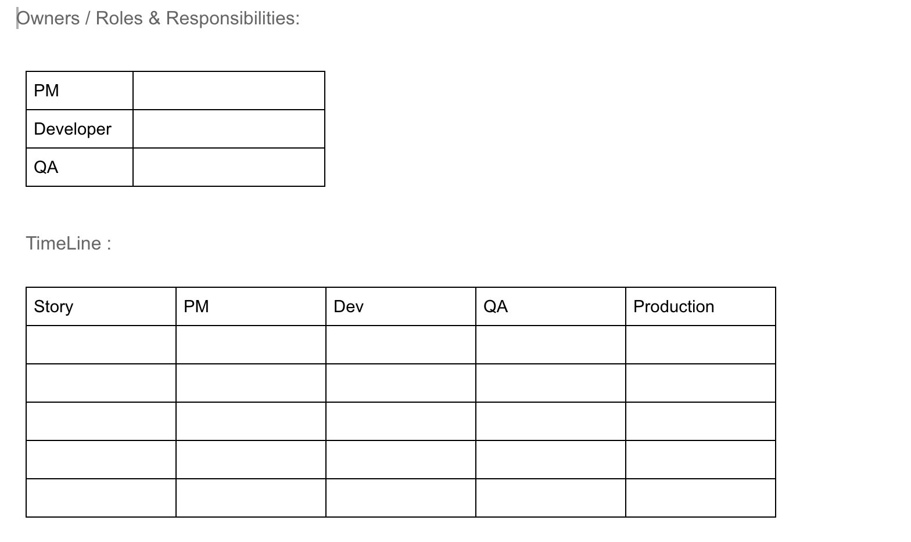

# Test Plan MobileApp
<br />
<br />
<br />
<br />

## Project Name: Mobile app name
<br />
<br />
<br />
<br />

## Environment to be tested:
```
As of now we testing on production code changes, but we need to set up a pipeline for Staging & production
```
<br />
<br />
<br />
<br />

## Documents/References : 

- Mind Map/Brain-Stroming **Ref- http://apps.testinsane.com/mindmaps/LONG-FUN-CUP-Mobile-App-Test-Coverage**


<br />
<br />
<br />
<br />

## TimeLine And Responsibility 

<br />
<br />
<br />
<br />

## InScope :
**Depends on projects**

- Our approach will be to leverage the functional testing & Non functional types of testing :
- Installation Testing – These tests consist of application installation and launching.[Not Important] Install in different devices.
- Functional Testing - Functional testing will be performed on devices that are covered under supported device matrix. Sanity (P0) and P1 tests will be covered for the mobile app actually on device. 
- Platform Integration Testing - This set will cover integration with key mobile components like, - keyboard, mobile settings, network (wifi/wan) and server interactions.[ Camera search , images search]
- Stress testing- Using API
- OOM Testing – We will try to run certain search tests for couple of times and track the CPU and memory Usage .
- Post launch Tests - This will be covered once the app is live and metrics gets generated. This will automatically help us to analyze the traffic, from every part of the US where the app is downloaded along with their varying network bandwidths, carriers etc. We will monitor the metrics. We will continue to capture the latency metrics for different screens - Home, Search etc[ not now but we can do from server side]
- Upgrade Tests – We need to make sure that updates are pushed automatically, user settings are retained after upgrade, and backward compatibility should be maintained.

<br />
<br />
<br />
<br />

## Out of Scope :
**Depends on projects**
- Documentation is not covered in this test 
- unknown 
- service level testing.


<br />
<br />
<br />
<br />

## Browser / OS Coverage : 
- List of browser/OS coverage with versions


<br />
<br />
<br />
<br />

## Test Data:
- what are test data needed while execution of projects
<br />
<br />
<br />
<br />
 
## Entrance Criteria
- Dev handoff meeting has been completed, and acceptance test cases have passed
- App launches without crashing
- Make sure the code bases are independent. Either for back end or front end. Code changes should be backward compatible.

<br />
<br />
<br />
<br />

## Risk assessment:
 1.	Product risk
 2.	Project risk
 3.	Business risk

## Risk Mitigation:
•	If there is a missing role inside a project team, ask a question to project team to get the answer before execution
•	KT should be done to avoid any circumstances.
•	Test plan , test report , test strategy should be reviewed by stakeholder and incorporation of feedback prior execution


<br />
<br />
<br />
<br />

## Checklist for QA:
 1.	Test plan created for project
 2.	Test plan is shared with stake holder
 3.	Schedule a review and sign off from team
 4.	Make sure minimal acceptance criteria is present and executed
 5.	Share the daily test report
 6.	Bug triage with team
 7.	Create a set of regression with need to be automated
 8.	Review the regression cases
 9.	Schedule the knowledge transfer
10.	Scheduled a bug bash

#### Test stage /scope/entry condition/exit condition
- Cover all test of all new feature
- Performance test/ tracking
- All the new feature BVT case pass
- No active blocking bug
- All new feature / project related test cases executed

#### UAT
- Cover the regression of round1
- Cover the integration plan
- Perf test
- ZBB
- Beta build ready
- No active critical/major functional bug
#### Final sign off:
- Final regression test
- Two days ZBB
- No critical /major bugs found in 24 hours
- One day code freeze
#### QA Sign off
- All testing is complete
- No P1 P2 bugs are unresolved
- Sanity passes with no failure
<br />
<br />
<br />
<br />


##  Test scenario for Non-Functional test:
- https://github.com/Trisha1212/MobileTestIdea/edit/master/README.md
<br />
<br />
<br />
<br />

## Open Question

